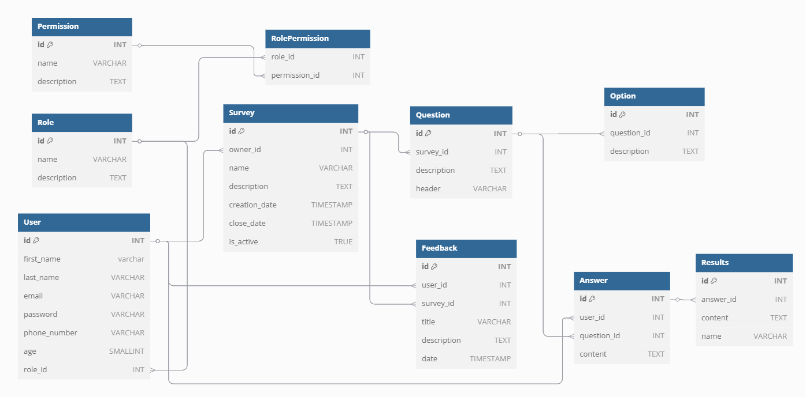

# Проєктування бази даних

В рамках проекту розробляється:

- модель бізнес-об'єктів
- ER-модель
- реляційна схема

## Реляційна схема
Реляційна схема - це набір таблиць, кожна з яких відповідає за одну з сутностей реляційної бази даних, та зв'язків між ними. Реляційна схема використовується для представлення реляційної бази даних. [[3]](https://www.sciencedirect.com/topics/computer-science/relational-schema#:~:text=A%20relational%20schema%20is%20a,applications%20belong%20to%20one%20schema.)

